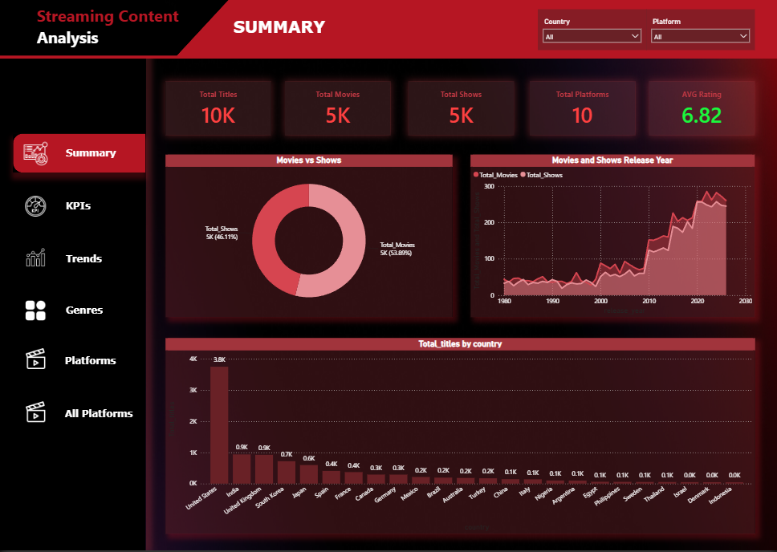
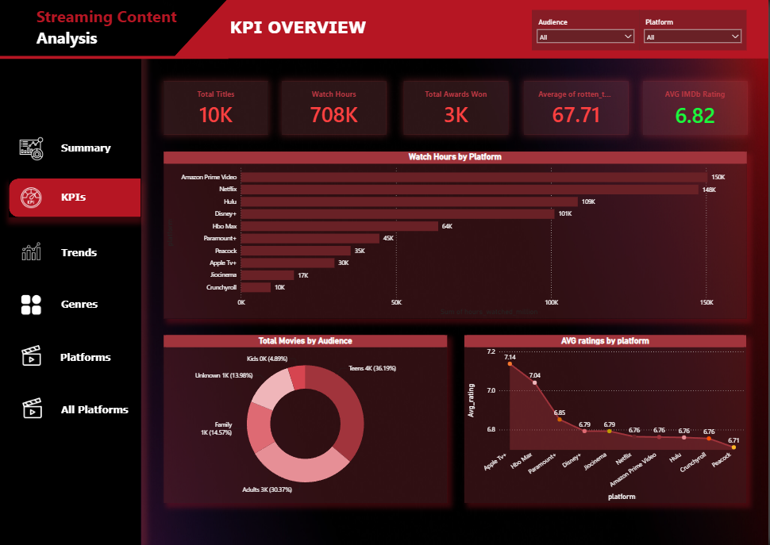
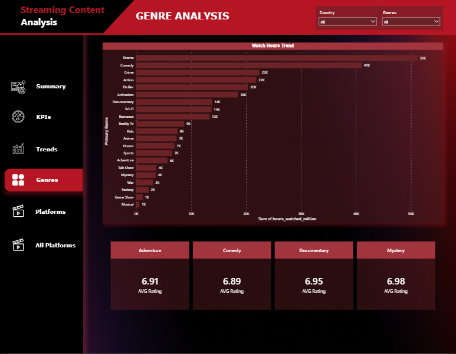
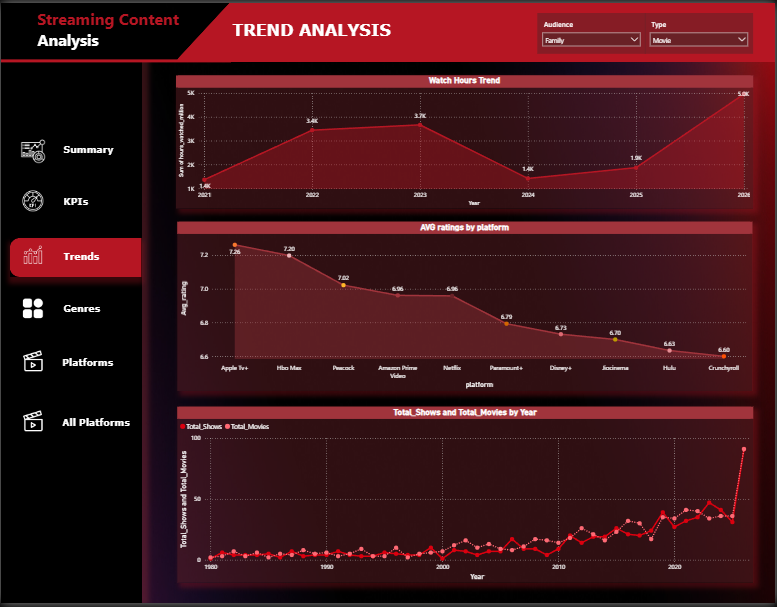
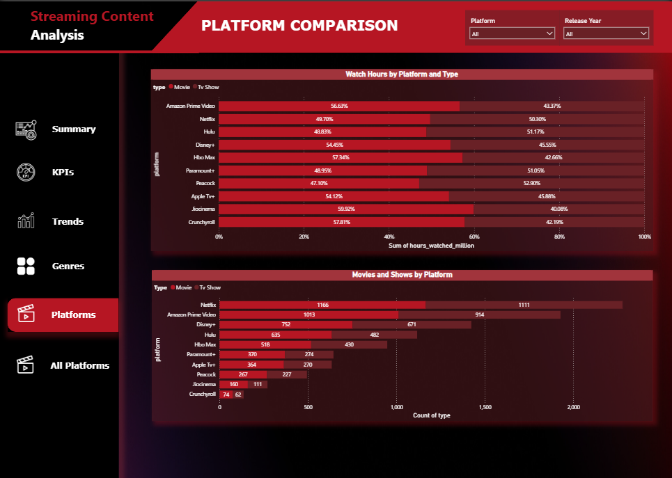
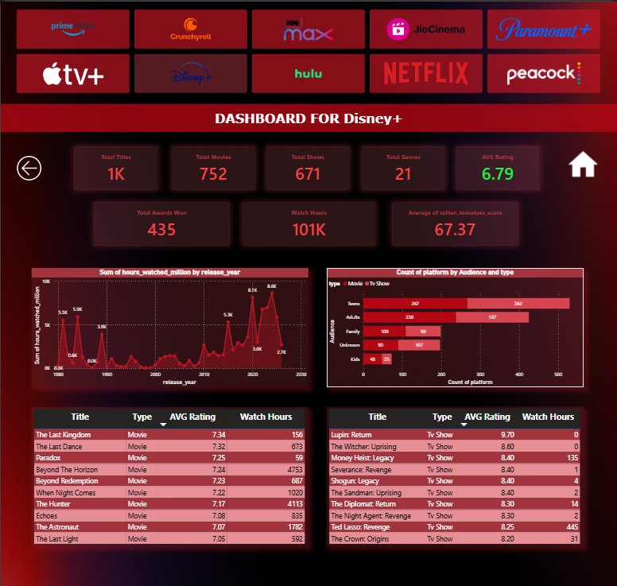

# OTT Streaming Platform Analytics Dashboard

## Project Overview

This project analyzes OTT streaming platform data to uncover content trends, viewer preferences, genre performance, and platform insights using Power BI.

## Business Problem

Streaming platforms need actionable insights to improve content strategy, user engagement, and revenue generation. This dashboard provides decision-makers with data-driven recommendations.

## Dataset

Features include:

* Title
* Genre
* Release Year
* Content Type
* Rating
* Country
* Platform
* Duration

## Objectives

* Analyze content distribution
* Identify top-performing genres
* Examine release trends
* Evaluate platform performance

## Dashboard Features

### Executive Summary

* Total Titles
* Total Movies
* Total TV Shows
* Average Rating

### Genre Analysis

* Most Popular Genres
* Genre Distribution

### Content Analysis

* Movie vs TV Show Split
* Year-wise Releases

### Geographic Analysis

* Country-wise Content Production

### Rating Analysis

* Content Rating Distribution

## Key Insights

* Drama and Comedy dominate content libraries.
* Movie content exceeds TV shows.
* Content production increased significantly after 2015.
* Certain countries contribute the majority of titles.

## Tools Used

* Power BI
* Excel
* SQL
* DAX
* Power Query

## Business Recommendations

* Increase investment in high-performing genres.
* Expand regional content offerings.
* Focus on audience-preferred ratings categories.

## Dashboard Preview

#### Executive Summary

#### KPI Section

#### Genre Analysis

#### Trends

#### Platform Comparison

#### All Dashboard Overview

## Author

Sourav Singha |
Data Analyst
